<!-- 🌇 Banner -->

  

# 👋 Hi, I'm Suryavamsi

💻 Backend Engineer | Go Developer | Kubernetes & SRE Enthusiast  
🚀 Building scalable backend systems & cloud-native applications  
⚙️ Distributed Systems | Observability | Performance

🌇 Engineer waiting for his dusk — building calm, reliable systems

---

## 🚀 What I Do

- ⚡ Build **high-performance backend services in Go**
- 🧱 Design **scalable microservices architectures**
- ☸️ Deploy and manage **Kubernetes-based systems**
- 📊 Implement **observability (Prometheus, Grafana)**
- 🔧 Work on **production systems & reliability engineering**

---

## 🚀 Featured Projects

 

---

## 🧰 Tech Stack

---

## 📊 GitHub Dashboard

  

---

## 📈 GitHub Stats

  
  

---

## 📊 Activity Graph

  

---

## 🐍 Contribution Snake

  

---

## 🌐 Connect With Me

  
  

---

✨ Focused on building systems that scale, perform, and last.

